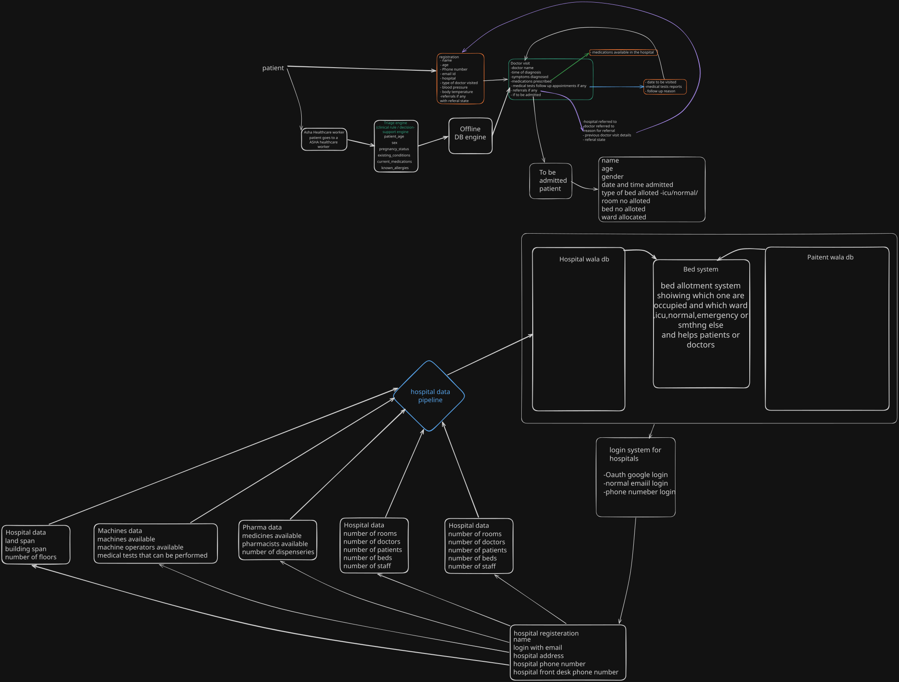
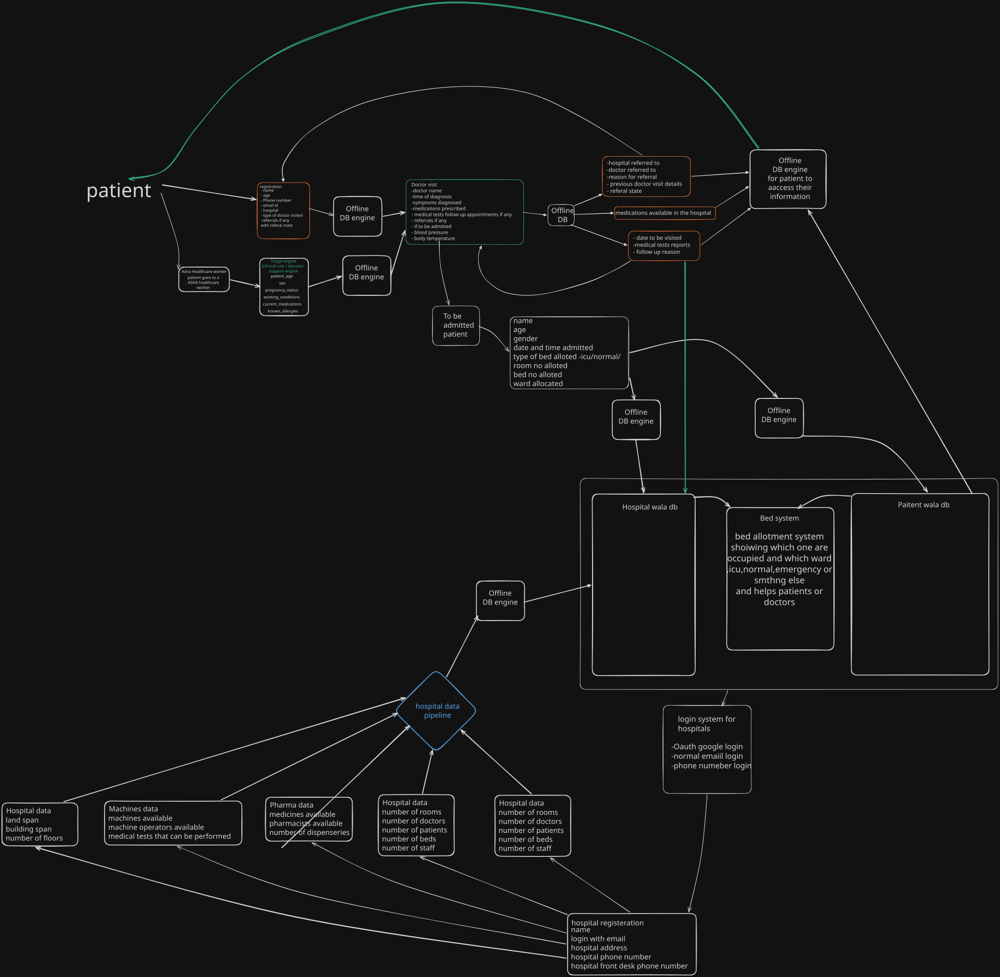

# Problem statement 26133
**Problem Statement Title**
Accessibility and quality of public healthcare services,particularly in rural and underserved areas
**Description**	
• ***Problem Description*** Rural and underserved communities may face long travel distances,shortages of specialists, irregular diagnostics, fragmented medical records, delayed referrals and limited awareness of available services. Primary health facilities may have constrained staff and equipment, while patients may move between sub-centres, primary health centres, rural hospitals and district hospitals without continuity of information. Connectivity, language,health literacy and affordability further affect access. The challenge is to improve timely access, continuity, quality and accountability while strengthening—not replacing—the public-health system.
• ***Expected Solution / Outcome*** An integrated care-access and quality support solution that may combine assisted teleconsultation, appointment and queue management, digital triage,longitudinal patient records, referral tracking, diagnostic coordination,medicine availability, high-risk patient follow-up and facility dashboards. It should support frontline health workers, low-connectivity environments,multilingual interaction, emergency escalation and interoperable health records based on approved standards.Expected outcomes include reduced travel and waiting time, earlier consultation, improved referral completion, better follow-up for maternal, child and chronic conditions,improved medicine/diagnostic availability visibility and enhanced quality monitoring.
**Organization**	Government Of Maharashtra
**Department**	Maharashtra State Innovation Society, Department of Skills, Employment, Entrepreneurship and Innovation
**Category** Software
**Theme** MedTech / BioTech / HealthTech

***system design link*** 
<<<<<<< Updated upstream

=======

### Frontend -  reactjs and react native would be best,for prototype it would be reactjs
### Backend- nodejs for code crud things,python for triage engine 
### Database- PostgreSQL for patient workflow and asha worker workflow and Firebase for hospital,doctor

## Where you need offline capability

Given the PS explicitly asks for this, here's where it actually matters in your system:

ASHA/field worker app — this is the big one. Patient registration, vitals capture, household visit logs all happen in villages with no signal. Must work fully offline.
Patient app — viewing your own past prescriptions, appointment details, and medicine reminders should still work with no internet (read-only cache is enough here).
PHC/doctor-side app — writing consultation notes and prescriptions at a rural PHC with patchy connectivity; doctor shouldn't lose work if the connection drops mid-consult.
Bed/inventory updates at the hospital — if a facility's connection drops, a bed status change or stock update should queue locally and sync later, not get lost.
Basic AI triage — if you want the symptom-checker to work even with zero signal, the lightweight rules engine should be able to run on-device, not require a server round-trip.

### **What to use for the offline database**

Dexie.js (a clean wrapper over the browser's IndexedDB) to store patient/visit data locally
Workbox (service worker) so the app shell itself loads even with no connection
This lets you demo the exact "airplane mode → register a patient → reconnect → synced" flow judges want to see, without needing to build a native app first
>>>>>>> Stashed changes
